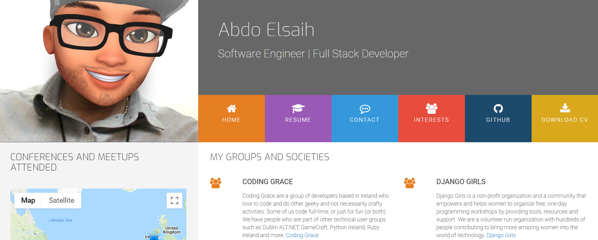

# Resume Website

## This is a front-end website called "Resume"

## This website was created as a project for Code Institute. To view the live site, [CLICK HERE](https://abdoelsaih.github.io/Resume/index.html)

## About the website
This is a Resume website, turn your CV into professional website resume that explains your professional background qualifications and skills just like a traditional resume.

## Features 
- Show your fun side professionally
- Show your skills
- Be unique
- Show your ability
- Eye catching profile
- Download you CV file in PDF 
- View my Github profile 
- You can also search on other user profiles 

## Technologies Used
- HTML and CSS - Base languages used to create the website
- jQuery
- Javascript
- Bootstrap
- Google Maps api
- JSON

## Mobile-responsive
- The webpages work on small to medium devices (i.e. mobile phones to laptops).

## Testing
- [W3C](http://validator.w3.org/#validate_by_uri) - Validate by direct input
- Site tested on these browsers: Google Chrome - Internet Explorer - Mozilla Firefox - Microsoft Edge - Safari

## Deployment
- The website was published using [GitHub pages](https://abdoelsaih.github.io/Resume/index.html)

